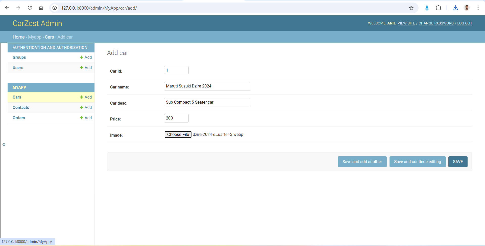

# Personal Details
Name - Mantu Kumar
College - IES College of Technology, Bhopal 


# Car-Rental-System
Car rental system using Django FrameWork.<br /> <br />
User can login and rent a car and can download the bill generated.

## About Django : 
Django is an MVT web framework that is used to build web applications.Django has an in-built administration interface which lets you handle your models, user/ group permissions and to manage users. With model interface in place, there is no need for a separate database administration program for all but advanced database functions.Django can check if an entered password is correct by running it through the hash function and comparing the output to the stored hash value.Internally, while it provides choices for almost any functionality you might want (e.g. several popular databases, templating engines, etc.), it can also be extended to use other components if needed.

## Tech Stack Used:
* HTML
* CSS
* Python 
* SQLITE3 (Default database of django)

## 📸 ScreenShots
<figure>
  

## Installation : 
```
**1. Create a Folder where you want to save the project**

**2. Create a Virtual Environment and Activate**

Install Virtual Environment First
```
$  pip install virtualenv
```

Create Virtual Environment

For Windows
```
$  python -m venv venv
```
For Mac
```
$  python3 -m venv venv
```
For Linux
```
$  virtualenv .
```

Activate Virtual Environment

For Windows
```
$  source venv/scripts/activate
```

For Mac
```
$  source venv/bin/activate
```

For Linux
```
$  source bin/activate
```

```

Then, Enter the project
```
$  cd e-voting-with-django
```

**4. Install Requirements from 'requirements.txt'**
```python
$  pip3 install -r requirements.txt
```

**5. Run migrations and migrate**
```python manage.py makemigrations```
```python manage.py migrate```

**6. Now Run Server**

Command for PC:
```python
$ python manage.py runserver
```

Command for Mac:
```python
$ python3 manage.py runserver
```

Command for Linux:
```python
$ python3 manage.py runserver
```

**7. Login Credentials**

Create Super User (HOD)
Command for PC:
```
$  python manage.py createsuperuser
```

Command for Mac:
```
$  python3 manage.py createsuperuser
```
```

